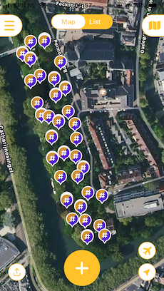
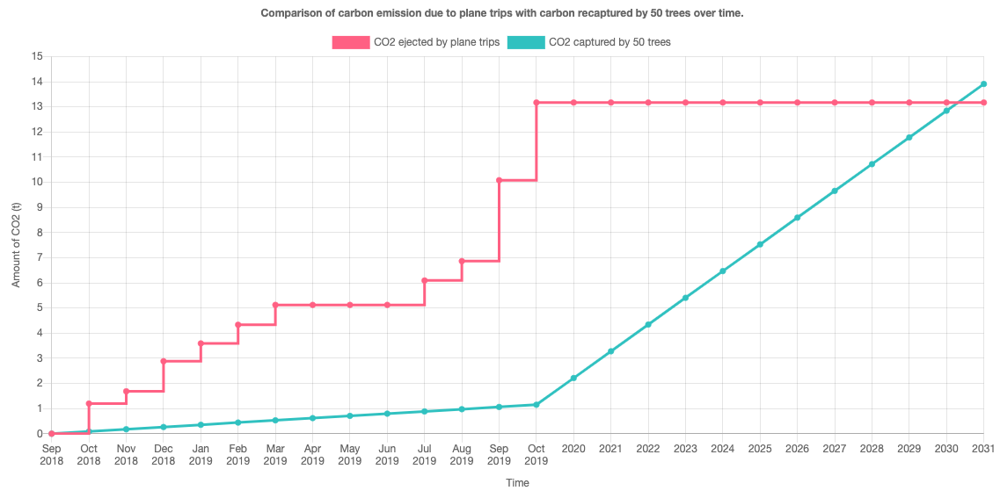

# The Land Life Company

Between 2018 and 2019, I embarked on an exciting adventure and traveled across 18 different countries.
For obvious time and budget reasons I used several planes during the trip and indirectly released an estimated total of 13.2 tons of CO2 in plane fuel.

Hence the following questions:
⇒ How many trees would I need to plant to compensate for these trips?
⇒ If I put myself in the shoes of a [Land Life Company employee](https://landlifecompany.com/) who is monitoring 50 trees how long would it take to recapture 13.2 tons of CO2?

## Reasoning

The first thing I needed to find was a formula to estimate the CO2 sequestration of a tree over time. I read several scientific papers and articles on the subject and decided to go with [this one](https://www.unm.edu/~jbrink/365/Documents/Calculating_tree_carbon.pdf).

It is reasonably simple and only requires 3 inputs:

1. Year of tree’s plantation
2. Diameter of the trunk
3. Height of the tree

For the first parameter I used the Dutch Open Data portal and found [this dataset](https://data.overheid.nl/dataset/bomenkaart) about Utrecht. It contains important pieces of information about the trees such as their age and geo coordinates.

For parameters 2 and 3 I went directly to a park nearby and took the measures.

For more info about the collected data have a look at the `data/Dataset.xlsx` file.

## Result:

Once all the data was collected, I exported it in a Spreadsheet (attached to this email) and made a simple dataviz using ChartJS.

[See it on Codepen](https://codepen.io/aegiz/full/NWNvWZd)

## Dev stack

-  JavaScript ([ChartJS](https://www.chartjs.org/))
-  CSS

## Inspiration and resources:

-  How to calculate CO2 sequestration
   https://www.ecomatcher.com/how-to-calculate-co2-sequestration/
   https://www.unm.edu/~jbrink/365/Documents/Calculating_tree_carbon.pdf
-  Which Trees Best Offset Global Warming?
   https://www.thoughtco.com/which-trees-offset-global-warming-1204209
-  Land life About us page
   https://landlifecompany.com/about-us/
-  Dataset of utrecht trees
   https://data.overheid.nl/dataset/bomenkaart
-  Examining the Viability of Planting Trees to Help Mitigate Climate Change
   https://climate.nasa.gov/news/2927/examining-the-viability-of-planting-trees-to-help-mitigate-climate-change/
-  Dataviz about trees canopy
   https://github.com/mittrees/Treepedia_Public
   http://senseable.mit.edu/treepedia/cities/amsterdam
